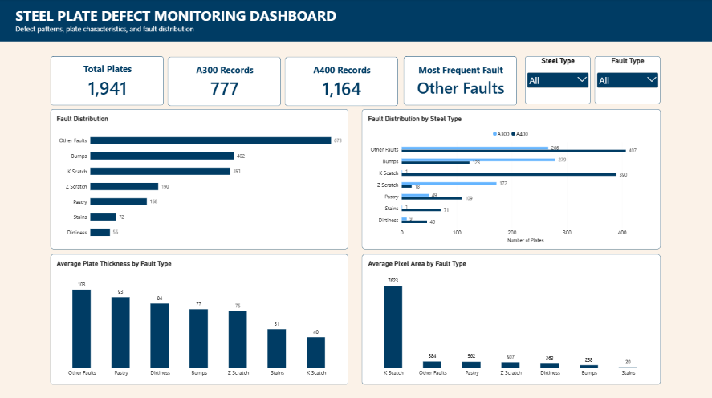

# Steel Plate Defect Monitoring Dashboard

A Power BI portfolio project focused on analyzing steel plate inspection data and monitoring defect patterns from an operational perspective.

The project uses the UCI Steel Plates Faults dataset to explore fault frequency, steel type distribution, plate thickness, and pixel area. The dashboard transforms raw inspection data into a practical reporting view that can support defect monitoring, data validation, and further operational investigation.

## Project Overview

This project was created to demonstrate how raw manufacturing inspection data can be prepared, validated, analyzed, and transformed into an interactive operational dashboard.

The analysis focuses on identifying patterns in steel plate defects and comparing defect characteristics across different fault categories and steel types.

## Business Objective

The main objectives of this project are to:

* Monitor the frequency and distribution of different fault types.
* Compare defect patterns between A300 and A400 steel types.
* Analyze average plate thickness across fault categories.
* Compare average pixel area across different fault categories.
* Provide a simple reporting view that can support defect monitoring and further operational investigation.

## Dataset

**Source:** UCI Machine Learning Repository – Steel Plates Faults Dataset

The dataset contains steel plate inspection measurements and fault classifications.

Key fields used in this project include:

* Steel Type — A300 / A400
* Fault Type
* Plates Thickness
* Pixel Area
* Other inspection-related measurements

The original dataset is not included in this repository. Please refer to the UCI Machine Learning Repository for the original dataset.

## Data Preparation

Data preparation was performed using **Power Query in Power BI**.

Key steps included:

* Reviewing the dataset structure and available fields.
* Checking and preparing data types.
* Identifying relevant fields for analysis.
* Preparing the data for aggregation and visualization.
* Validating key metrics against the source data.

## Dashboard & Metrics


The dashboard was designed as a one-page operational monitoring view.

### KPI Overview

* **Total Plates** — total number of plates in the dataset.
* **A300** — number of A300 plates.
* **A400** — number of A400 plates.
* **Most Frequent Fault** — most frequently recorded fault category.

### Defect Analysis

* **Fault Distribution** — overall frequency of each fault category.
* **Fault Distribution by Steel Type** — comparison of fault frequency between A300 and A400.

### Plate Characteristics

* **Average Plates Thickness by Fault Type**
* **Average Pixel Area by Fault Type**

### Interactive Filters

The dashboard includes slicers for:

* Fault Type
* Steel Type

These filters allow users to explore the data from different perspectives.

## Key Insights

### 1. Other Fault is the most frequently observed defect

Other Fault has the highest number of recorded defects in the dataset, while Dirtiness has the lowest occurrence.

This makes Other Fault a prominent category for further operational review.

### 2. Other Fault occurs more frequently in A400 plates

Other Fault appears more frequently in A400 plates than in A300 plates.

This difference highlights a variation in defect distribution between the two steel types and provides a direction for further analysis.

### 3. Plate thickness varies across fault categories

Other Fault has the highest average plate thickness among the fault categories, while K Scratch has the lowest.

This indicates that average plate thickness differs across defect categories and may be useful for further investigation.

### 4. K Scratch has the highest average pixel area

K Scratch has the highest average pixel area, while Stains has the lowest.

Pixel area provides an additional descriptive dimension for comparing different defect categories.

## Operational Recommendations

* Prioritize further review of the **Other_Fault** category because of its high occurrence.
* Compare defect patterns between **A300 and A400** to identify differences that may require closer monitoring.
* Monitor the relationship between **plate characteristics and observed fault categories** over time or across production batches when additional production data is available.
* Use **pixel area** as an additional descriptive metric when monitoring changes in detected defect characteristics.

These findings should be treated as areas for further investigation rather than confirmed root causes, as the current dataset does not contain sufficient production-level information to determine underlying causes.

## Tools & Skills

* Power BI
* Power Query
* Data Preparation & Validation
* KPI Reporting
* Data Analysis
* Data Visualization
* Operational Reporting
* Descriptive Analysis
* Insight Generation

## Project Structure

```text
steel-plate-defect-monitoring/
│
├── README.md
│
├── powerbi/
│   └── Steel_Plate_Defect_Monitoring_Dashboard.pbix
│
└── screenshots/
    └── dashboard.png
```

## Project Purpose

This project was created as a personal portfolio project to demonstrate practical skills in working with operational data, building reporting dashboards, validating metrics, and identifying patterns that can support production operations and further investigation.
